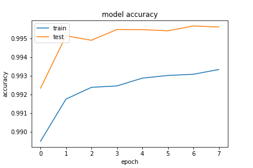
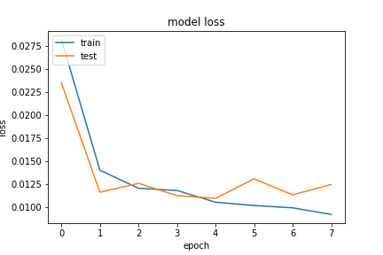

# segmentation lésion pulmonaires  

Le but de ce brief est de détecter des lésions pulmonaires à partir de la segmentation d'images selon une méthode d'apprentissage à partir d'un modèle UNET pré-entraîné.

## Etape 1: 

Les adresses des images sont chargées à partir du dossier initial 'images' afin de diviser les adresses en jeux de validations, de tests et d'entraïnement. Les fichiers sont ensuite copiés dans les dossier train, val et test. 

 

## Etape 2:

Pour ce brief, les dossier train, val et test sont importés dans un google drive. Nous passons sur Google Colab afin d'avoir à disposition un GPU.  

## Etape 3:

Les images sont chargées à partir du Drive, mises dans des tableaux numpy, redimensionnées (256 pixels par 256 pixels), et mises à une échelle comprise entre 0 et 1. 

## Etape 4:  

Le peu d'images disponibles donnera peu de résultats, nous choisissons donc d'augmenter le nombre d'images par 'data-augmentation'. Le jeu d'images est entraïné sur le jeu de train, et appliqué au données de test.

## Etape 5:

Nous utilisons la bibliothèque segmentation-models pour utiliser le modèle Unet, une succession de couches qui permet de bons résultats de de segmentations. Plusieurs modèles pré-entraînés sont disponibles pour les couches d'entrées (vgg, resnet,...)  

Le modèle est initialisé avec ResNet34, et les poids de 'imagenet'. Nous choisissons d'évaluer le modèle avec le F1-score, un bon indicatif entre précision et rappel, et l'accuracy.
Les données sont entraînées sur 4 epochs. 

## Etape 6:

Au bout de 3 'Epochs', nous obtenons : 
> val_loss: 0.0124 - val_acc: 0.9956 - val_recall_1: 0.8132 - val_precision_1: 0.8542 - val_f1-score: 0.8297 

#### Récapitulatif des métriques :   

 
 
 

A la première itération, puis après 3 itérations, la balance entre recall et précision semble optimale pour ce jeu de données. Le F1-score donne une bonne indication pour ce cas entre recall et précision (scores sensiblement équivalents).   
Le projet ne définit pas quelle métrique entre la précision (détecter le plus d'anomalies possibles, quitte à avoir souvent des interventions humaines de vérification), et le recall (fiabilité des détections, quitte à ne pas détecter quelques lésions) doivent être maximisés. Nous arrêtons l'apprentissage à ce stade.  

## Etape 7:

Nous affichons une image du dossier d'évaluation (jamais 'vue' lors de l'entraînement du modèle), afin de visualiser l'image originale, la prédiction et la lésion initialement segmentée manuellement.
La prédiction est correcte.

